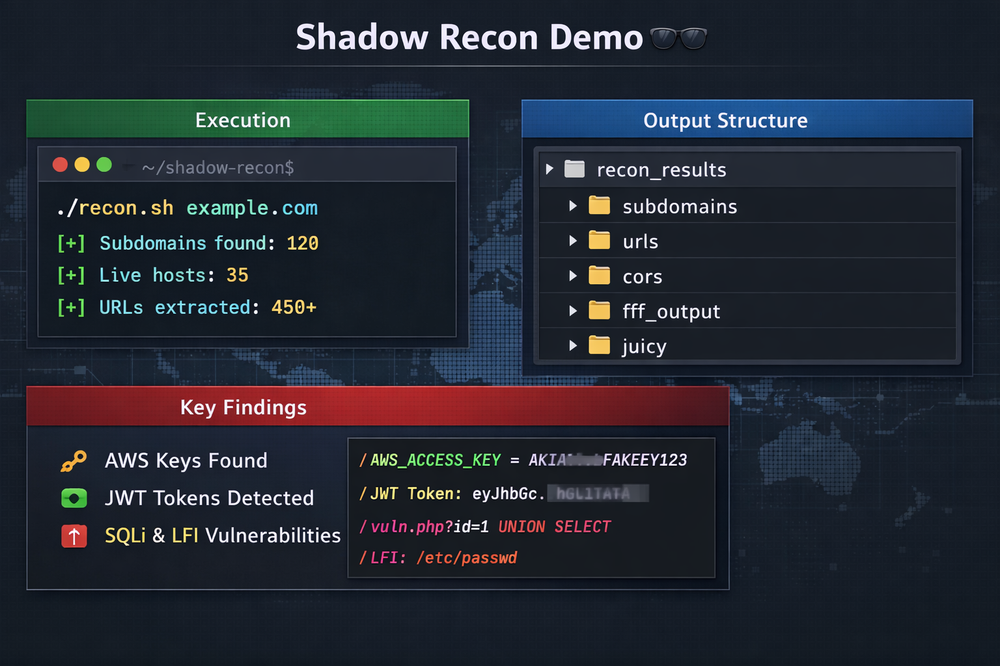

<div align="center">

```
███████╗██╗  ██╗ █████╗ ██████╗  ██████╗ ██╗    ██╗
██╔════╝██║  ██║██╔══██╗██╔══██╗██╔═══██╗██║    ██║
███████╗███████║███████║██║  ██║██║   ██║██║ █╗ ██║
╚════██║██╔══██║██╔══██║██║  ██║██║   ██║██║███╗██║
███████║██║  ██║██║  ██║██████╔╝╚██████╔╝╚███╔███╔╝
╚══════╝╚═╝  ╚═╝╚═╝  ╚═╝╚═════╝  ╚═════╝  ╚══╝╚══╝

██████╗ ███████╗ ██████╗ ██████╗ ███╗   ██╗
██╔══██╗██╔════╝██╔════╝██╔═══██╗████╗  ██║
██████╔╝█████╗  ██║     ██║   ██║██╔██╗ ██║
██╔══██╗██╔══╝  ██║     ██║   ██║██║╚██╗██║
██║  ██║███████╗╚██████╗╚██████╔╝██║ ╚████║
╚═╝  ╚═╝╚══════╝ ╚═════╝ ╚═════╝╚═╝  ╚═══╝
```

# 🕵️ Shadow Recon

**Automated reconnaissance toolkit for bug bounty & security testing**

[](https://www.gnu.org/software/bash/)
[](LICENSE)
[]()
[](https://hackerone.com)
[](https://linkedin.com/in/nishantpadha)

<br/>

> *"Reconnaissance is the foundation of every successful security assessment."*

</div>

---

## 📑 Table of Contents

- [✨ Features](#-features)
- [🖼️ Demo](#️-demo)
- [🛠️ Tech Stack](#️-tech-stack)
- [📁 Output Structure](#-output-structure)
- [🚀 Usage](#-usage)
- [⚙️ How It Works](#️-how-it-works)
- [📖 Documentation](#-documentation)
- [🔮 Future Improvements](#-future-improvements)
- [⚠️ Disclaimer](#️-disclaimer)
- [👤 Author](#-author)

---

## ✨ Features

<table>
<tr>
<td width="50%">

### 🔍 Reconnaissance
- **Subdomain Enumeration** — powered by Subfinder & Assetfinder
- **Live Host Detection** — via httprobe
- **URL Collection** — Wayback URL archiving *(optional)*
- **HTTP Data Extraction** — full response harvesting

</td>
<td width="50%">

### 🎯 Vulnerability Detection
Powered by **GF pattern matching**:

| Pattern | Description |
|--------|-------------|
| 🔑 API Keys | Exposed API credentials |
| ☁️ AWS Keys | Amazon cloud secrets |
| 🪙 JWT Tokens | Auth token exposure |
| 💉 SQLi | SQL injection vectors |
| 📂 LFI | Local file inclusion |
| 💻 RCE | Remote code execution |
| ↩️ Redirects | Open redirect endpoints |

</td>
</tr>
</table>

> 📊 **Organized, structured output** for efficient and clean analysis every time.

---

## 🖼️ Demo

<div align="center">

<!-- Replace with actual screenshot -->


*Add your screenshots to the `assets/` folder and update the path above*

</div>

---

## 🛠️ Tech Stack

<div align="center">

| Tool | Purpose |
|------|---------|
|  | Core scripting engine |
| **Subfinder** | Passive subdomain discovery |
| **Assetfinder** | Asset-based subdomain discovery |
| **httprobe** | Live host probing |
| **httpx** | HTTP toolkit for fingerprinting |
| **waybackurls** | Historical URL collection |
| **gf** | Grepping with pattern matching |
| **fff** | Freaking fast fetcher |

</div>

---

## 📁 Output Structure

```
recon_results/
│
├── 📂 subdomains/       ← All discovered subdomains
├── 📂 urls/             ← Collected URLs from various sources
├── 📂 cors/             ← CORS misconfiguration findings
├── 📂 fff_output/       ← Raw HTTP responses
└── 📂 juicy/            ← Vulnerability pattern matches
    ├── api-keys
    ├── aws-keys
    ├── jwt
    ├── sqli
    ├── lfi
    ├── rce
    └── redirects
```

---

## 🚀 Usage

### 1️⃣ Make Scripts Executable

```bash
chmod +x setup.sh recon.sh addscope.sh
```

### 2️⃣ Run Setup

```bash
./setup.sh
```

> This installs all required tools and sets up your environment.

### 3️⃣ Run Reconnaissance

```bash
./recon.sh example.com
```

> Replace `example.com` with your **authorized** target domain.

### 4️⃣ Add Scope *(Optional)*

```bash
./addscope.sh
```

---

## ⚙️ How It Works

```
┌────────────────────────────────────────────────────────────────┐
│                      SHADOW RECON PIPELINE                     │
└────────────────────────────────────────────────────────────────┘
         │
         ▼
  ┌─────────────┐
  │  1. Collect  │  ← Subfinder + Assetfinder gather subdomains
  └──────┬──────┘
         │
         ▼
  ┌─────────────┐
  │  2. Filter   │  ← Deduplicate, clean, normalize data
  └──────┬──────┘
         │
         ▼
  ┌─────────────┐
  │  3. Probe    │  ← httprobe finds live, responsive hosts
  └──────┬──────┘
         │
         ▼
  ┌─────────────┐
  │  4. Extract  │  ← URLs & HTTP responses via fff + waybackurls
  └──────┬──────┘
         │
         ▼
  ┌─────────────┐
  │  5. Analyze  │  ← GF runs vulnerability pattern matching
  └──────┬──────┘
         │
         ▼
  ┌─────────────┐
  │  6. Output   │  ← Structured results saved to recon_results/
  └─────────────┘
```

---

## 📖 Documentation

| Document | Description |
|----------|-------------|
| 📄 [usage-guide.md](usage-guide.md) | Detailed usage instructions & examples |
| 📋 [requirements.md](requirements.md) | Tool requirements & installation guide |

---

## 🔮 Future Improvements

- [ ] ⚡ Add parallel execution for faster scans
- [ ] 🏁 Add CLI flags for granular control
- [ ] 📊 Improve output visualization & reporting
- [ ] 🔬 Integrate Nuclei for active vulnerability scanning
- [ ] 🌐 Web dashboard for result review
- [ ] 📬 Notification support (Slack / Telegram)

---

## ⚠️ Disclaimer

> [!CAUTION]
> **Shadow Recon is intended for educational purposes and authorized security testing only.**
>
> 🚫 Do **NOT** use this toolkit against systems you do not own or have explicit written permission to test.
> Unauthorized use may violate laws and regulations including the **Computer Fraud and Abuse Act (CFAA)** and similar legislation in your jurisdiction.
>
> The author assumes **no responsibility** for misuse of this tool.

---

<div align="center">

<br/>


---

<sub>Made with ❤️ and a terminal window — Shadow Recon © 2025 Nishant Padha</sub>

</div>
